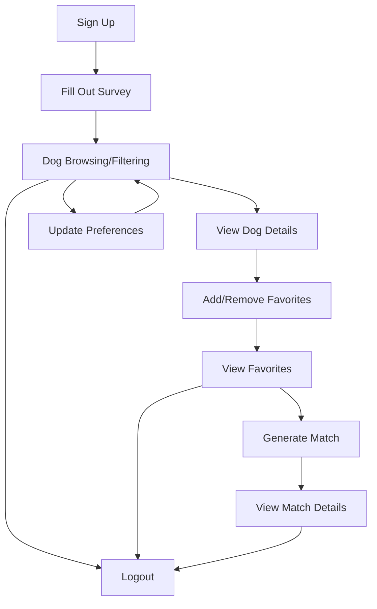

# Henry's Dog Adoption Agency

A modern web application for browsing and finding your perfect canine companion! This app allows users to browse available dogs, filter by various criteria, add favorites, and receive personalized matches based on their preferences.

## 🐶 Features

- **Dog Browsing**: View all available dogs with filtering options
- **Favorites**: Save your favorite dogs for later viewing
- **Match Algorithm**: Receive personalized dog recommendations based on your favorites
- **User Authentication**: Secure sign up and login using JWT, bcrypt, and MongoDB
- **Security**: Avoids information leakage and follows best practices for error handling
- **Responsive Design**: Works on desktop and mobile devices
- **Interactive UI**: Smooth animations and intuitive interface
- **Improved UI/UX**: Enhanced layout, accessibility, and mobile experience

## 🎯 Dog Ranking & Sorting

The application implements multiple ways to rank and sort dogs:

1. **Manual Sorting**

   - Users can sort dogs by:
     - Breed (A-Z or Z-A)
     - Name (A-Z or Z-A)
     - Age (1-9 or 9-1)
   - Sorting is implemented using MongoDB's collation for case-insensitive string comparisons

2. **Suggested Dogs Ranking**

   - Dogs are ranked based on a weighted scoring system that considers:
     - Age match (weight: 4)
     - Energy level compatibility (weight: 3)
     - Barking level compatibility (weight: 2)
     - Shedding level compatibility (weight: 2)
     - Compatibility bonuses (weight: 1 each):
       - Good with children
       - Good with other dogs
       - Good with strangers
       - Good with other animals

3. **Match Generation**
   - When generating matches, the system:
     - Randomly selects from user's favorites
     - Ensures no repeat matches
     - Tracks match history per user

Example of sorting implementation:

```typescript
// Sort object for MongoDB query
const sortObj: Record<string, 1 | -1> = {};
if (sort) {
  const [field, order] = sort.split(":");
  sortObj[field] = order === "asc" ? 1 : -1;

  // Add collation for string fields
  if (field !== "age") {
    collation = {
      locale: "en",
      strength: 2, // Case-insensitive comparison
      alternate: "shifted", // Handle special characters
    };
  }
}
```

User Example:

```typescript
// Example user preferences
const userPreferences = {
  ageRange: [2, 5],
  energy_level: 3,
  barking_level: 2,
  shedding_level: 1,
  good_with_children: true,
  good_with_other_dogs: true,
  good_with_strangers: false,
  good_with_other_animals: true,
};

// Example dog matches and their scores
const dogMatches = [
  {
    name: "Buddy",
    age: 3,
    energy_level: 3,
    barking_level: 2,
    shedding_level: 1,
    good_with_children: true,
    good_with_other_dogs: true,
    good_with_strangers: true,
    good_with_other_animals: true,
    matchScore: 12, // Perfect match! (4 + 3 + 2 + 2 + 1)
  },
  {
    name: "Max",
    age: 6,
    energy_level: 4,
    barking_level: 3,
    shedding_level: 2,
    good_with_children: true,
    good_with_other_dogs: false,
    good_with_strangers: true,
    good_with_other_animals: true,
    matchScore: 7, // Partial match (0 + 2 + 1 + 1 + 3)
  },
];
```

## 🧭 User Flow

1. **Sign Up**

   - User creates an account with email/username and password.
   - Immediately after signup, the user is redirected to a **survey page**.

2. **Onboarding Survey**

   - New users (or users without preferences) must fill out a survey.
   - The survey collects preferences such as dog size, age range, energy level, barking level, shedding level, good with kids/other animals/strangers, and borough/location.
   - Upon submission, preferences are saved to the backend and the user is redirected to the main dog browsing page.

3. **Browsing & Filtering Dogs**

   - Users see a list of adoptable dogs, filtered or sorted based on their survey preferences.
   - Users can further filter/search using UI controls.
   - Clicking a dog opens a modal with detailed info and a favorite button.

4. **Favorites**

   - Users can favorite or unfavorite dogs, which are saved to the backend and shown in a dedicated section.
   - Users can view all their favorited dogs in one place.

5. **Matching**

   - Users can generate a match from their favorites.
   - The app selects a random favorite dog the user hasn't matched with before.
   - The matched dog is shown in a modal with details and a "Try Again" option.

6. **User Preferences**

   - Users can revisit and update their survey/preferences at any time.

7. **Logout**
   - Users can log out, which clears their session and local data.



## 🆕 Recent Enhancements

- **Suggested Dogs**: Users now receive personalized suggested dog matches, stored and displayed per user.
- **Customizable Carousel**: The DogCarousel component supports a variable number of cards per slide, auto-advance (autoNextSlide), and optional dot navigation (showDots prop).
- **Robust Authentication**: Improved JWT authentication with automatic access token refresh using refresh tokens, and defensive handling of expired/malformed tokens.
- **Error Handling**: Enhanced error and loading state management throughout the app, including graceful handling of 401 errors and infinite loop prevention.
- **UI Controls**: Carousel navigation, dot indicators, and match generation are now fully customizable via props.
- **Client-Side State Guards**: All localStorage and client-only logic is guarded to prevent hydration mismatches and layout issues on navigation.
- **Security**: Defensive checks for malformed/expired tokens, and secure cookie management.

## 🚀 Tech Stack

- **Frontend Framework**: [Next.js](https://nextjs.org/) 15.3.0 with React 19
- **State Management**: [Redux Toolkit](https://redux-toolkit.js.org/) with React-Redux
- **Styling**: CSS Modules for component-scoped styling
- **Language**: TypeScript for type safety
- **HTTP Client**: Axios for API requests
- **Database**: MongoDB for persistent storage
- **Authentication**: JWT (jsonwebtoken) and bcrypt for secure user authentication
- **Animations**: canvas-confetti for celebration effects
- **Routing**: Next.js App Router and react-router-dom

## 📋 Prerequisites

- Node.js 18.x or higher
- npm or yarn package manager
- MongoDB instance (local or cloud)

## 🛠️ Setup Instructions

1. **Clone the repository**

   ```bash
   git clone https://github.com/<yourusername>/henrys-dog-adoption-agency.git
   cd henry-dog-adoption-app
   ```

2. **Install dependencies**

   ```bash
   npm install
   # or
   yarn install
   ```

3. **Set up environment variables**

   Create a `.env.local` file in the root directory and add your MongoDB URI and JWT secrets:

   ```env
   MONGODB_URI=your-mongodb-uri
   JWT_SECRET=your-jwt-secret
   JWT_REFRESH_SECRET=your-jwt-refresh-secret
   ```

4. **Run the development server**

   ```bash
   npm run dev
   # or
   yarn dev
   ```

5. **Open in browser**

   The application will be available at [http://localhost:3000](http://localhost:3000)

## 🔧 Available Scripts

- `npm run dev` - Start the development server with Turbopack
- `npm run build` - Build the application for production
- `npm run start` - Start the production server
- `npm run lint` - Run ESLint to catch issues
- `npm run test` - Run Jest tests

## 📱 Application Structure

- **pages/api/** - Backend API endpoints organized by functionality (auth, dogs, locations)
- **src/app/** - Next.js App Router pages and layouts for main application views
- **src/components/** - Reusable UI components organized by feature:
  - **auth/** - Login form and authentication-related components
  - **dogs/** - Dog cards, listing, filtering and favorites components
  - **layout/** - Structural components (Header, Footer, Navigation)
  - **ui/** - Generic UI components (Button, Modal, Container)
- **src/hooks/** - Custom React hooks for reusable logic
- **src/lib/** - Utility functions and API client implementation
- **src/store/** - Redux store with slices organized by domain (auth, dogs, filters)
- **src/types/** - TypeScript type definitions for app-wide use

## 🛡️ Security & Best Practices

- Uses **bcrypt** for password hashing and **JWT** for stateless authentication
- All sensitive operations are handled server-side with MongoDB
- Error messages are generic to avoid information leakage
- Follows best practices for authentication and authorization

## 📈 Improvements

- Enhanced UI/UX for a smoother and more accessible experience
- Improved error handling and security throughout the app
- Responsive and mobile-friendly design

## 🤝 Contributing

Contributions are welcome! Please feel free to submit a Pull Request.
